# IT Monitoring with Zabbix 
DevOps project for monitoring of Linux servers (Lubuntu), RPi devices and web servers (Nginx, Apache) with usage of Zabbix.

### System Diagram


### General Overview
The purpose of this project is to monitor Linux servers, RPi devices, web servers with usage of Zabbix Agents and SNMP.
Central object of this monitoring suite is the Zabbix server ver. 7.4.
Zabbix is open-source monitoring solution which makes network and application monitoring very simple.

Zabbix gives the complete visibility into every layer of IT and OT infrastructure, while integrating smoothly with existing systems.

SNMP is an application layer protocol that transmits data between network devices.

The entire project is implemented using Docker.

## License

Starting from Zabbix version 7.0, all subsequent Zabbix versions will be released under the GNU Affero General Public License version 3 (AGPLv3).
You can modify the relevant version and propagate such modified version under the terms of the AGPLv3 as published by the Free Software Foundation.
For additional details, including answers to common questions about the AGPLv3, see the generic FAQ from the [Free Software Foundation](http://www.fsf.org/licenses/gpl-faq.html).

Zabbix is Open Source Software, however, if you use Zabbix in a commercial context we kindly ask you to support the development of Zabbix by purchasing some level of technical support.
All previous Zabbix software versions up to 6.4 are released under the GNU General Public License version 2 (GPLv2). The formal terms of the GPLv2 and AGPLv3 can be found at http://www.fsf.org/licenses/.

## Deploy Zabbix v.7.4 server & UI with docker-compose

```
cd env_vars
nano .env_agent
```
check that the ZBX_HOSTANME has assigned a name:

`ZBX_HOSTNAME=Zabbix server`

<br><br>
Start the docker compose:
```
docker compose -f docker-compose.yaml  --profile all up -d
```

After all containers are running, login into `Zabbix UI` using credentials.
Open Zabbix web page:
```
http://<SERVER_IP_ADDRESS>:80
```

```
username: Admin
password: zabbix
```

[Configuration of host devices for monitoring by Zabbix](#configuration-of-host-devices-for-monitoring-by-zabbix)

[Monitoring Apache HTTP by Zabbix agent](#monitoring-apache-http-by-zabbix-agent)

[Monitoring Nginx web server by Zabbix agent](#monitoring-nginx-web-server-by-zabbix-agent)

[Monitoring host with SNMP by Zabbix agent](#monitoring-host-with-snmp-by-zabbix-agent)

[All hosts monitoring dashboards](#all-hosts-monitoring-dashboards)


## Configuration of host devices for monitoring by Zabbix
Zabbix Agent2 is deployed on each monitoring target to actively monitor local resources and application (e.g. web server).

Download Zabbix for respective target:

* Ubuntu:

 `wget https://repo.zabbix.com/zabbix/7.4/release/ubuntu/pool/main/z/zabbix-release/zabbix-release_7.4-1+ubuntu24.04_all.deb`

* RPi:

`wget https://repo.zabbix.com/zabbix/7.4/release/raspbian/pool/main/z/zabbix-release/zabbix-release_latest_7.4+debian11_all.deb`

Install downloaded package and agent2:
```
sudo dpkg -i zabbix-release_7.4-1+ubuntu24.04_all.deb
```
OR
```
sudo dpkg -i zabbix-release_latest_7.4+debian11_all.deb
sudo apt update

sudo apt install zabbix-agent2
```
<br><br>

Configure Zabbix Agent:
```
sudo nano /etc/zabbix/zabbix_agent2.conf
```
Customize the file:
```
Server=<IP_ADDRESS_OF_SERVER_ZABBIX>
ServerActive=<IP_ADDRESS_OF_SERVER_ZABBIX>
Hostname=host_name
```
`host_name` - name of the respective host (can be checked by `hostname` command)


Save file and start service:
```
sudo systemctl restart zabbix-agent2 
sudo systemctl enable zabbix-agent2
```

Examples of Agent2 host config in Zabbix UI:

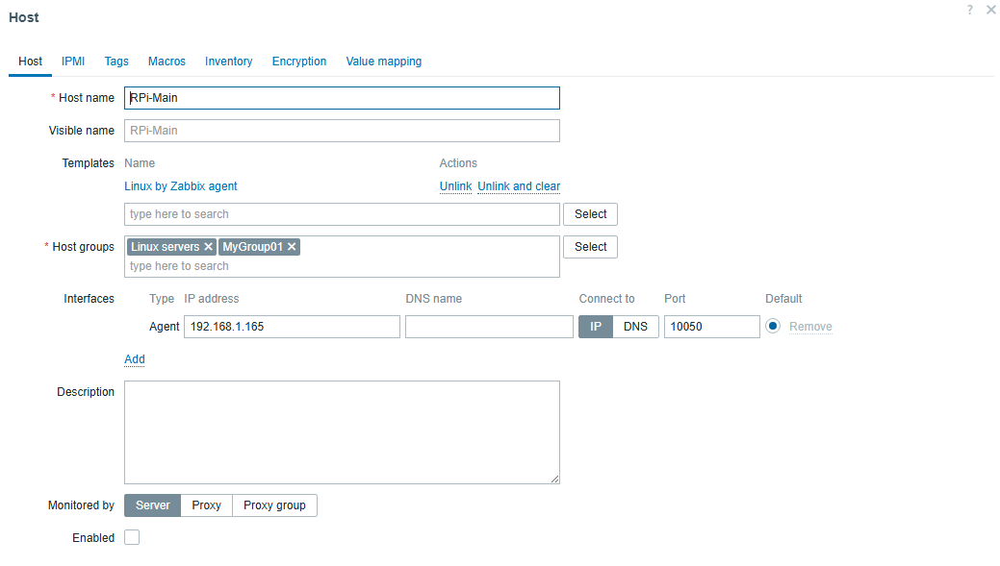
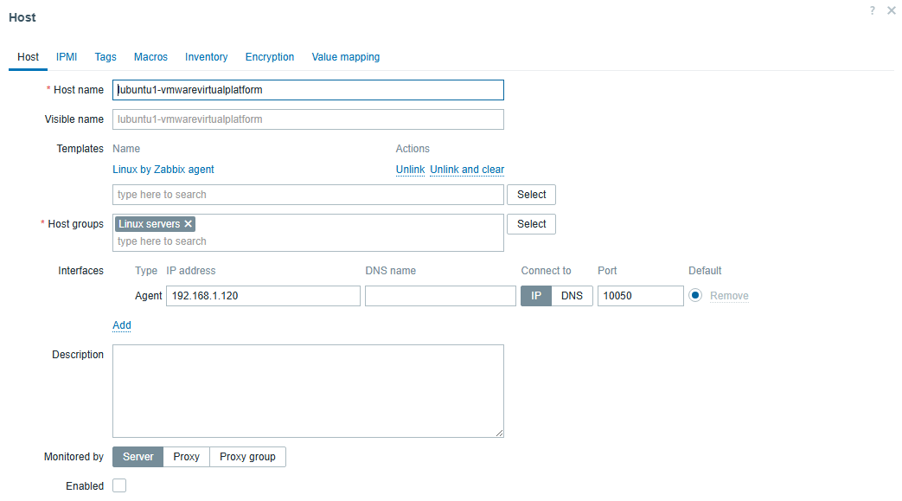

<br>

Customized dashboards for `Linux by Zabbix agent`:

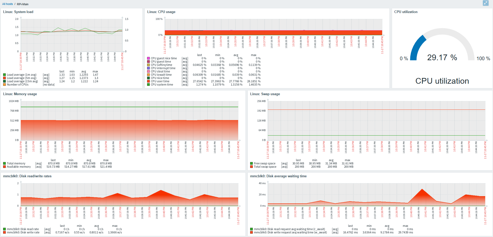
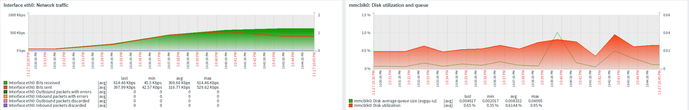


## Monitoring Apache HTTP by Zabbix agent

This configuration allows deployment of Apache web server monitoring.

Install and enable `mod_status` on the Apache server.

`mod_status` is an Apache module that helps to monitor web server load and current httpd connections with an HTML interface that can be accessed via a web browser.

Apache’s `mod_status` shows a plain HTML page containing the information about current statistics of the webserver including:
 * Total number of incoming requests
 * Total number of bytes and counts server
 * The CPU usage of Webserver
 * Server Load
 * Server Uptime
 * Total Traffic
 * Total number of idle workers
 * PIDs with the respective clients and many more.


Apache ships with the mod_status module already enabled.

Verify this by checking the `mods_enabled` directory by running command:
```
ls /etc/apache2/mods-enabled | grep status*
```
<br>

Ensure that the status.conf and status.load files are present:
```
status.conf
status.load
```

Configure `mod_status` in Apache Ubuntu:
```
sudo nano /etc/apache2/mods-enabled/status.conf
```
Add `Require ip <ip_address_of_zabbix_server>`:
```
        <Location /server-status>
                SetHandler server-status
                Require local
                Require ip <IP_ADDRESS_ZABBIX_SERVER>/24
        </Location>
```

For this project the IP address of Zabbix server is:
```
Require ip 192.168.1.110/24
```
<br>

Restart the Apache web server:
```
sudo systemctl restart apache2
sudo systemctl status apache2
```

<br>
Check the server status:

```
http://server-ip/server-status
```
If everything runs properly, there should be metrics available:
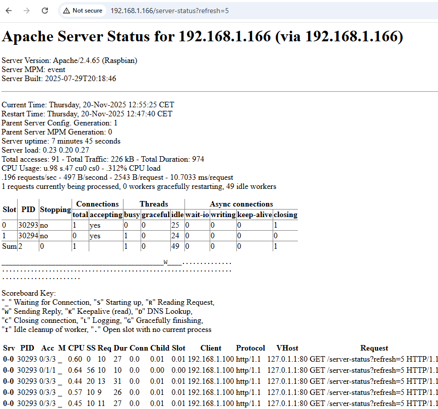

<br>

Next, configure host in Zabbix UI for Apache HTTP monitoring:
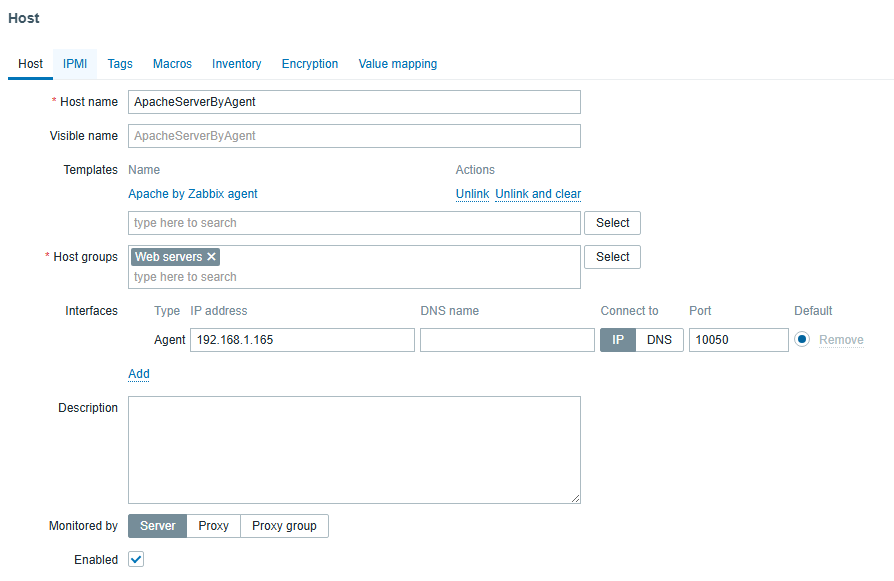

Dedicated dashboards for Apache server monitoring are created under `Dashboards/ApacheDashboard`:

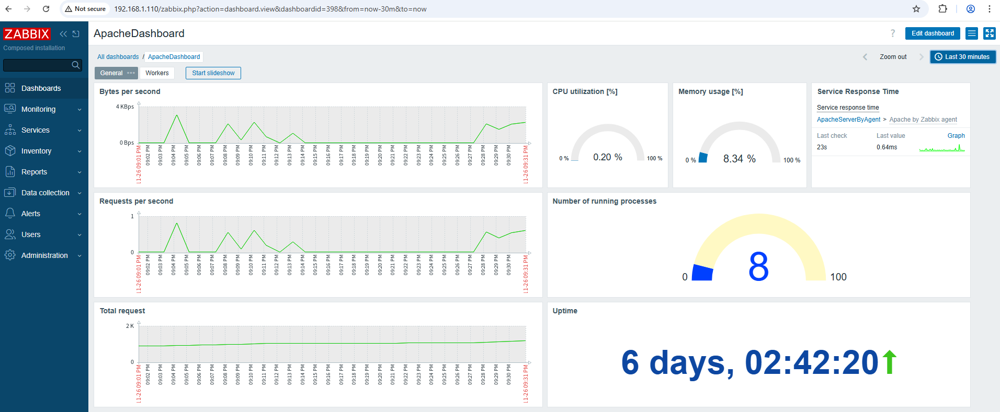
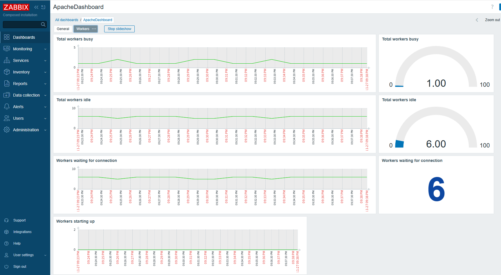
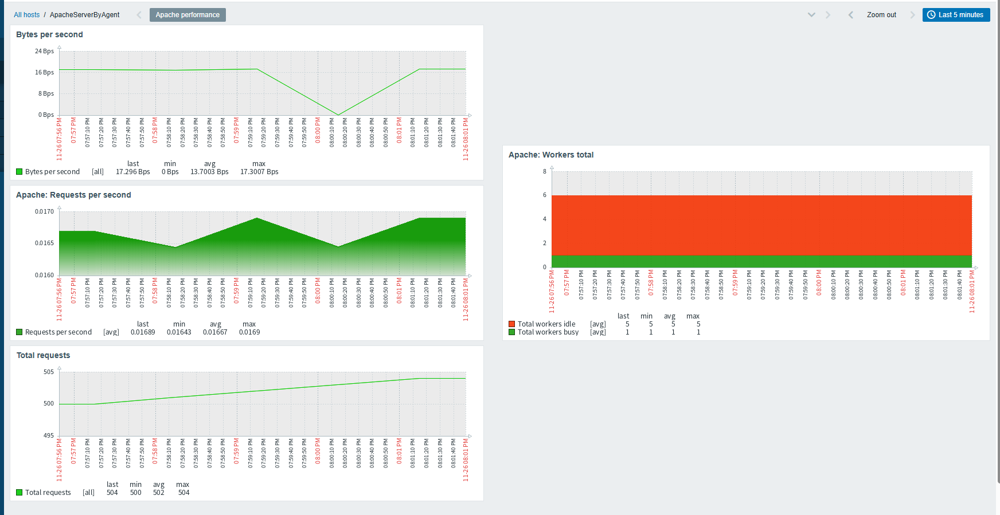

<br>

## Monitoring Nginx web server by Zabbix agent

On the Nginx host, enable `ngx_http_stub_status_module` to allow metrics generation for `Nginx`:
```
sudo nano /etc/nginx/conf.d/default.conf  
```
where `192.168.1.110` is the `IP address` of the Zabbix server:
```
server {
	listen 85
	server_name localhost;
	allow 127.0.0.1;
	allow 192.168.1.110;

	location /nginx_status {
			stub_status;
			allow 127.0.0.1;
			allow 192.168.1.110;
			deny all;
		}
}
```
<br>

Restart Apache server:
```
sudo systemctl start nginx
sudo systemctl enable nginx
```

Next, configure Nginx host in Zabbix UI:

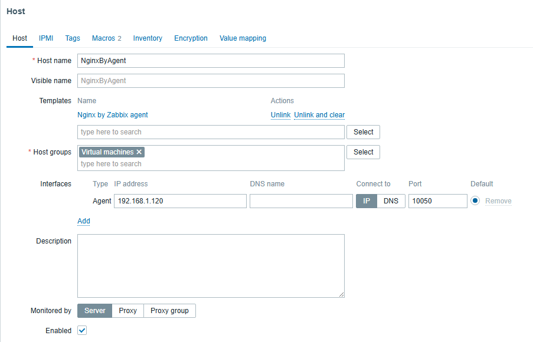

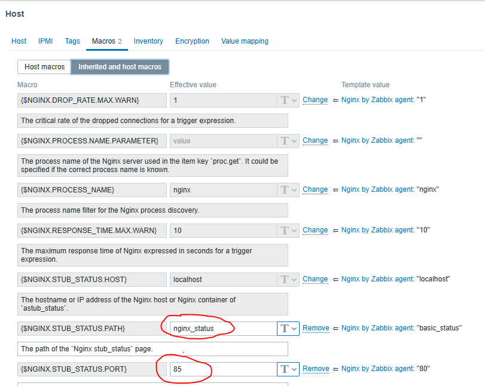

<br>

Customized dashboards for `Nginx by Zabbix agent`:
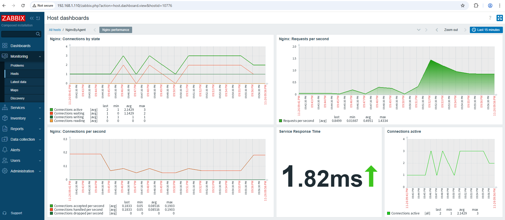


## Monitoring host with SNMP by Zabbix agent

Perform following on the host to be monitoring using SNMP:

Install snmp agent service:
```
sudo apt update
sudo apt install snmpd
```
<br>

Configure the `snmpd.conf` file:
```
sudo nano /etc/snmp/snmpd.conf
```
Inside the file:
```
sysLocation		Lubuntu 192.168.1.121
sysContact		TomF <TomF@email.org>

agentAddress	udp:161, udp6:[::1]:161

rocommunity 	snmpro
rocommunity6	snmpro

createUser bootstrap MD5 temp_password DES

rwuser bootstrap priv
rwuser demo priv
```
<br>

After finishing restart `snmpd` service:
```
sudo service snmpd restart
```


<br>
Install snmp `manager server`:

```
sudo apt update
sudo apt install snmp snmp-mibs-downloader
```

Configure the `snmpd.conf` file:
```
sudo nano /etc/snmp/snmp.conf
```

To allow the manager to import the MIB files, comment out the `mibs` line:
```
#mibs
```
<br><br>

Configure UFW to allow connections from the manager server to this port:
```
sudo ufw allow from 192.168.1.121 to any port 161
```
where `192.168.1.121` is the IP address of host to be monitored with SNMP.

<br>

From the manager server, check if the bootstrap account is available.
Type the following to display the system information for the agent server:
```
snmpget -u bootstrap -l authPriv -a MD5 -x DES -A temp_password -X temp_password <agent_server_ip_address> 1.3.6.1.2.1.1.1.0
```
```
snmpget -u bootstrap -l authPriv -a MD5 -x DES -A temp_password -X temp_password 192.168.1.121 1.3.6.1.2.1.1.1.0
```

The `1.3.6.1.2.1.1.1.0` string is the `OID` that is responsible for displaying system information. It will return the output of `uname -a` on the remote system.

This will give the following output:

```
SNMPv2-MIB::sysDescr.0 = STRING: Linux agent 4.15.0-66-generic #75-Ubuntu SMP Tue Oct 1 05:24:09 UTC 2019 x86_64
```

Now it is verified that it is possible to authenticate to the server running the SNMP daemon.


Next, configure SNMP host in Zabbix UI:

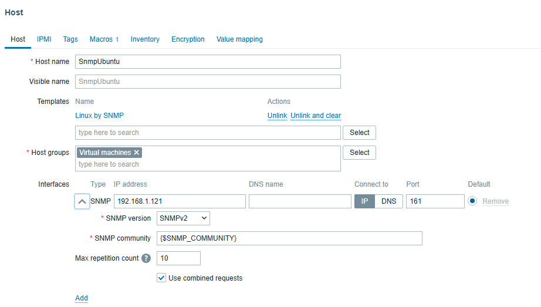

<br>

Customized dashboards for `Linux by SNMP`:

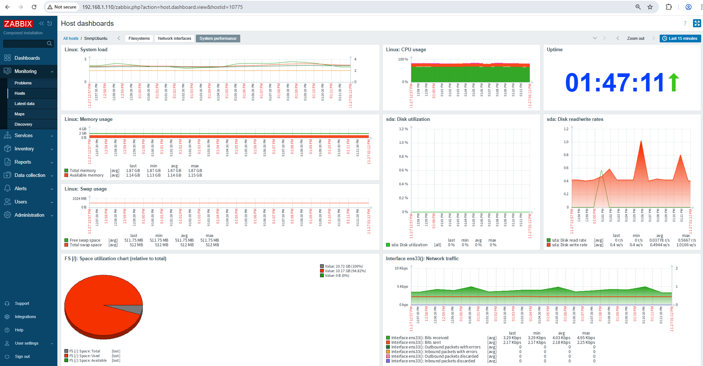


## All hosts monitoring dashboards

Following dashboards display host metrics from different perspective.


Under `Monitoring/Hosts` status about all hosts is displayed:

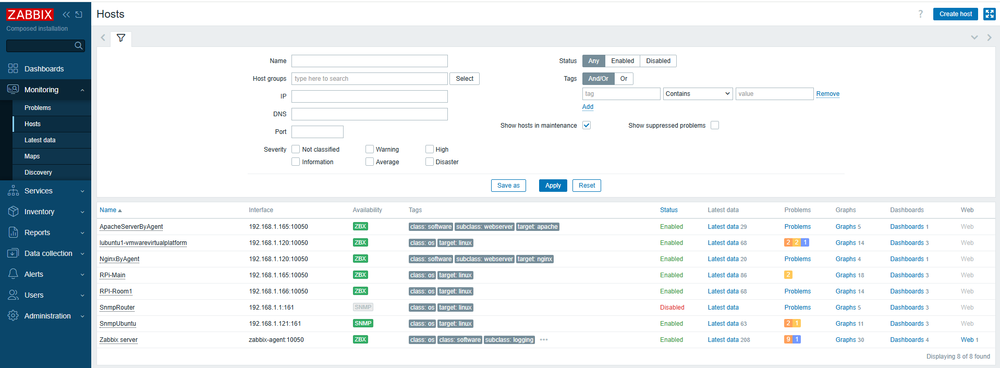

<br>

Under `Dashbords/Global view` it shows the status of all hosts and Zabbix server:

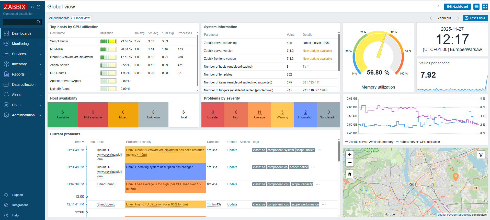

<br>

Under `Monitoring/Problems` it shows current warnings/alarms with different severity:
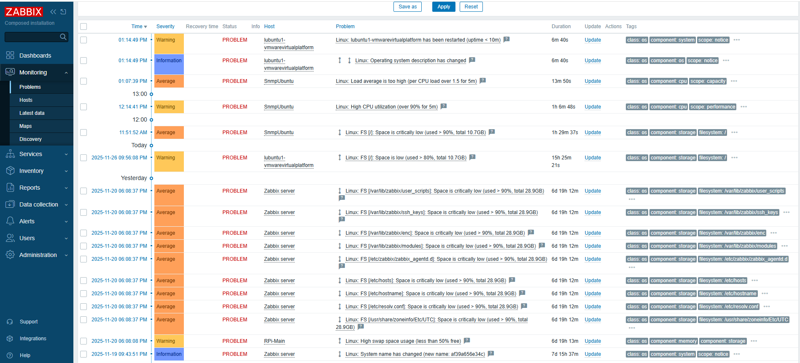